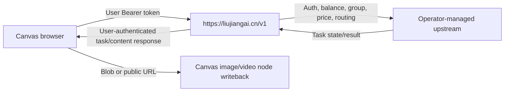

# New API Production Dependency Record

Last reconciled: 2026-08-14 (Asia/Shanghai). This document connects the canvas
implementation to the separate New API deployment record. It contains no user
tokens, administrator credentials, upstream keys, Baota password, Rainyun
password, cookie, or media-gateway secret.

## Fixed contract

The canvas uses one built-in relay origin only:

```text
https://liujiangai.cn/v1
```

Relevant code:

| File | Responsibility |
| --- | --- |
| `web/src/services/api/aicopy.ts` | `AICOPY_BASE_URL`, public model metadata, New API request scripts |
| `web/src/stores/use-config-store.ts` | restores and normalizes the built-in channel to the fixed origin |
| `web/src/components/layout/channel-editor-drawer.tsx` | prevents editing the built-in channel URL or protocol |
| `web/src/services/api/video.ts` | task creation, polling, protected content fetch, and video-node result handoff |
| `web/src/services/api/image.ts` | image-generation/edit request and image-node result handoff |

Each user registers, funds their balance, and creates their own ordinary New
API token in New API. The canvas stores that user token only in that browser's
configuration. It does not receive an administrator token, upstream token, or
payment credential.

## Request and preview path



For a protected New API video result, the canvas polls the task and fetches
`/v1/videos/{task_id}/content` using the same user's Bearer token. It validates
the result as media before storing it as node metadata. This avoids returning a
protected URL that a `<video>` element cannot load by itself.

The optional media gateway is separate. Local images, video, and audio are
uploaded with a user-supplied short-lived gateway token to obtain public HTTPS
reference URLs. Canvas source must never contain a COS secret or long-lived
gateway credential.

## Current production dependency state

- `liujiangai.cn` is the intended HTTPS New API origin; the canvas must never
  fall back to the historic HTTP IP or directly call an upstream provider.
- Production New API task polling has a narrow fallback for an external
  upstream's broken authenticated status route. It accurately changed one
  historic stuck task to `FAILURE`; it has not yet been verified against a
  successful video media result.
- Canvas image/video result parsing, polling, protected-content retrieval, and
  writeback are type/build/contract tested. A successful live New API task has
  not been used to prove the preview path, because no paid duplicate request
  was authorized.
- `seedance-2.5-stable` is present in the canvas code as **Seedance 2.5 Stable
  Channel**, but its New API JuKe adapter/channel is not deployed. It must not
  be advertised as live until the New API VPS is healthy, the application image
  is deployed, the owner configures the channel privately, and a token-scoped
  model listing exposes it to the intended groups.
- On 2026-08-13, Rainyun NoVNC showed blocked Docker/PostgreSQL tasks for more
  than 120 seconds on the New API VPS. This is host-health work, not a canvas
  code defect. Do not modify canvas request format as a response to it.

## Model-specific status

| Public product | Canvas code | New API/upstream finding | Next safe verification |
| --- | --- | --- | --- |
| Image models | Request/result parsing implemented | No live paid result used during this work | User-token `/v1/models`, then an explicitly authorized limited request |
| SD2.5 per-second | Request and polling implemented | Upstream returned temporary 503 and one configured model disappeared from its inventory | Reconcile upstream availability; do not alter canvas duration/polling as a workaround |
| SD2.0 720p per-request | Request and mapping contract implemented | Upstream channel key lacks `sd2-720p` entitlement (403) | Owner restores upstream product entitlement |
| Seedance 2.5 Stable Channel | Request contract and UI metadata implemented | JuKe application adapter is local-only; not deployed or configured | Finish healthy-server deployment, then verify `/v1/models` without a paid generation |

## Operator boundaries

Use the deployment repository's
`docs/PRODUCTION_ACCESS_AND_DEPLOYMENT.md` before opening Rainyun VNC, Baota,
or replacing New API. It records the recovery path, scoped container deployment
rule, and the instruction to leave PostgreSQL/Redis/volumes untouched.

If a model fails in the canvas, first correlate the user-visible error with the
New API task log and upstream response. Do not issue retries merely to make a
preview appear: a retry can bill the user and consume upstream balance.

## GitHub handoff

This canvas repository is pushed to:

```text
https://github.com/liujiang2218931557/liujiangai-infinite-canvas.git
```

After a documentation or code change, verify it with:

```powershell
git status --short
git diff --check
git add <intended-files>
git commit -m "docs: describe the change"
git push liujiang main
git ls-remote liujiang refs/heads/main
```

If the local proxy prevents access to `github.com:443`, enable the operator's
normal proxy/VPN and retry. For a one-command diagnostic that does not modify
global settings, use `git -c http.proxy= -c https.proxy= push liujiang main`.
Do not put tokens in remotes or use an untrusted mirror.
